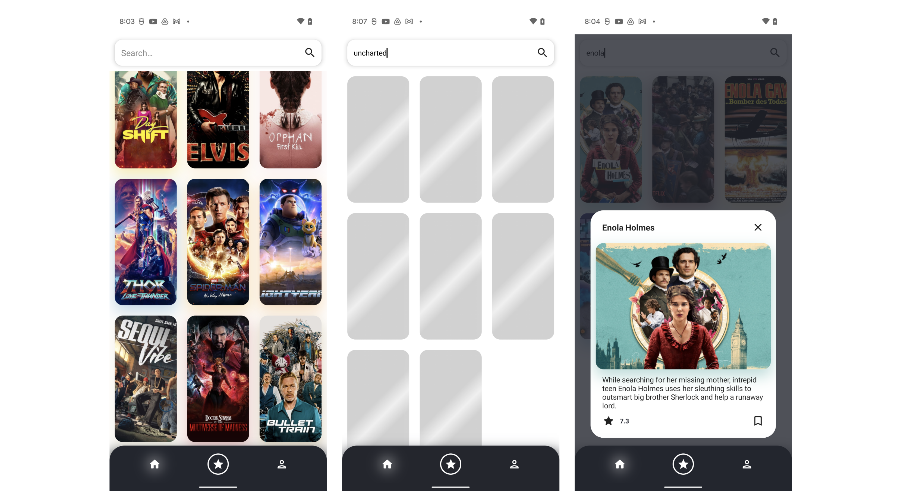
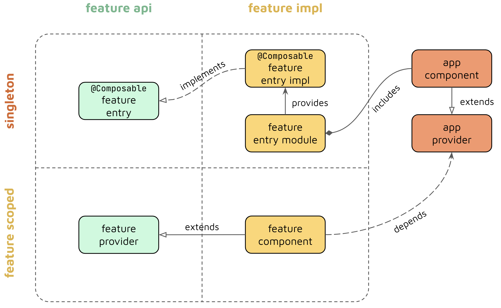

# Multi-Module Movies
Multi-Module Movies is a The Movie DB project that demonstrates how to build a scalable multi-module architecture for Android apps that use Jetpack Compose.



## How to build locally
Add your API key in `local.properties` file.
```xml
tmdb_api_key=API_KEY
```

## Technologies  
The codebase is written in **Kotlin** language with **Jetpack Compose** as a primary UI framework.  
In addition, the following technologies are used in the project:  
- *Compose Paging* - for displaying paginated UI lists.
- *Coil* - for loading images.  
- *Compose Navigation* - for navigating between features.  
- *Kotlin Coroutines* - for concurrency.  
- *Dagger* - for dependency injection.  
- *Retrofit* - for networking.  
- *Room* - for persistence and offline mode.  
  
## Architecture  
The project implements a scalable multi-module architecture that aims to achieve the following goals:  
- **Separation of concerns** - strict isolation and separation of logic between features for easier *testability* and *maintainability* of a codebase.  
- **Scalability** - the architecture is applicable for projects that use hundreds or thousands Gradle/Bazel modules.  
- **Dependency graph optimization** - allows keeping a developer productivity on a decent level by preventing long build times and ensuring efficient incremental builds.
  
All the project modules could be separated into **3** types:  
- **Feature modules** - which hold a logic related to a specific feature and consist of **API** and **Impl** modules. Former are framework-agnostic and hold lightweight interfaces as feature entry points.  
- **Library modules** - commonly used logic by other features.  
- **Injector modules** - modules that build a dependency graph of the app. E.g. *app* module.  
  
  
  