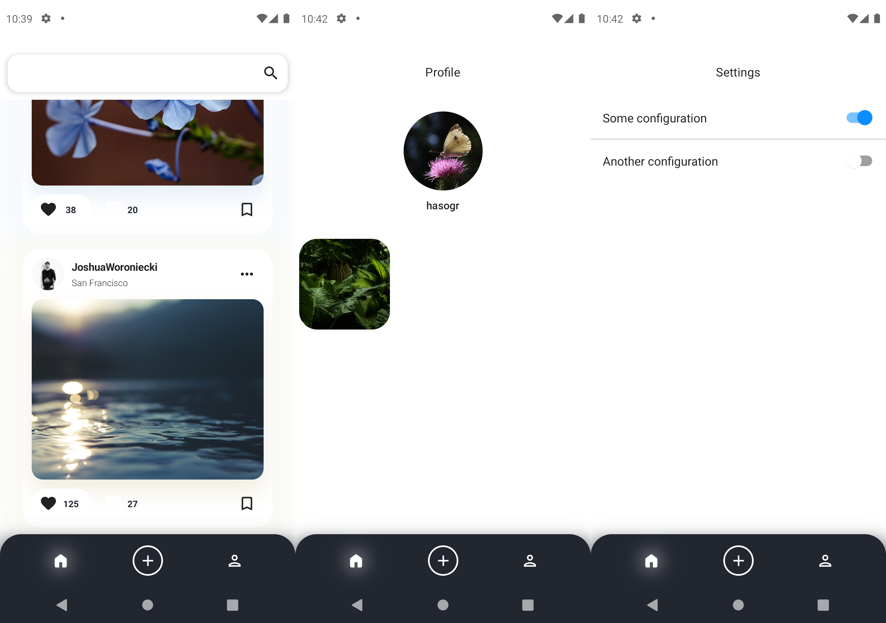
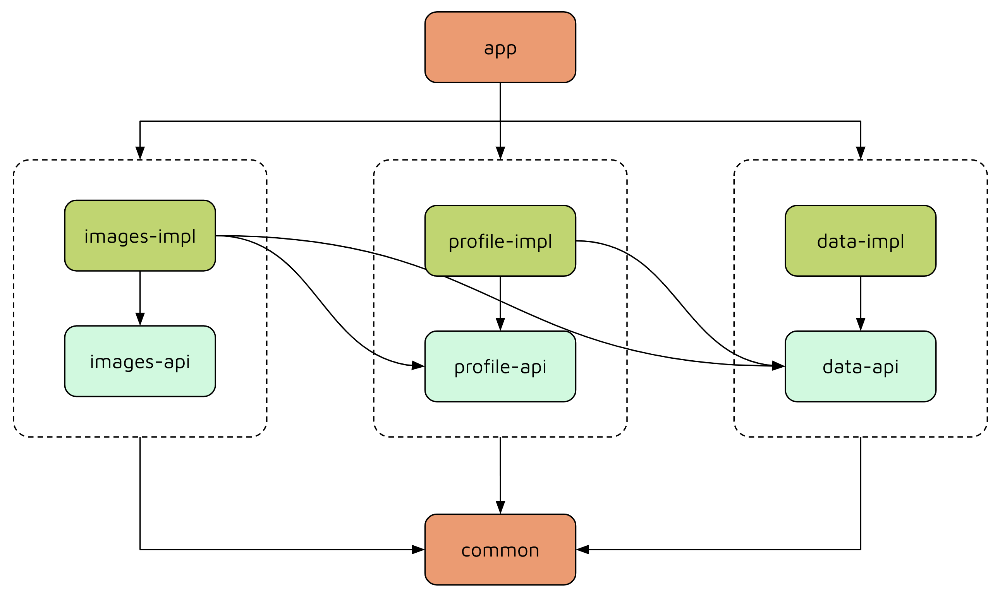
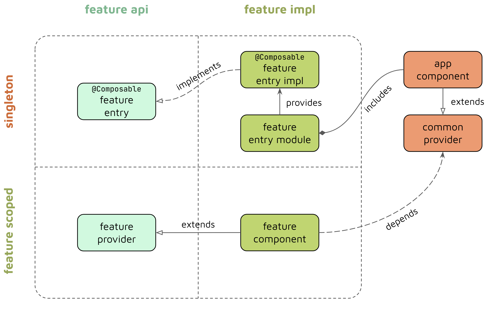

# Compose Multi-Module Architecture Sample
Sample project that shows an approach for designing a multi-module architecture for Jetpack Compose
Android applications.

<div>
  <table><tr><td>
    
  </td></tr></table>
</div>

## Publications
- [Navigating through multi-module Jetpack Compose applications](https://proandroiddev.com/6c9a31fa12b6)
on ProAndroidDev
  
## Architecture

<div>
  
</div>

The app uses a multi-module architecture that splits each **feature** module into 2 parts:

**API** - that defines a set of public interfaces that allow other application components to interact with the feature. No specific implementation logic is allowed here.
**Implementation** - that contains all the internal implementation details of the feature. Other features are now aware of this part which means that any update to the application binary interface (ABI) won't force Gradle or Bazel to rebuild all modules that depend on it.
The **app** module is considered as a dependency injector and an entry point to the application. It's main purpose is to build the dependency graph and then route the user to specific application features that are defined in other modules.

In addition, there is a core module that contains all the shared code for all other modules.

This sample application contains the following feature modules:

**images** - shows image feed by specific user query.
**profile** - displays profile details of a specific selected user.
**data** - provides access to the data layer of the application such as network API and persistence.

<div>
  
</div>

## Bazel
In addition to Gradle, this project is also buildable with [Bazel](https://bazel.build/) build system.

In order to run the app with Bazel use the following command.
```shell
bazelisk mobile-install //app:bin
```
